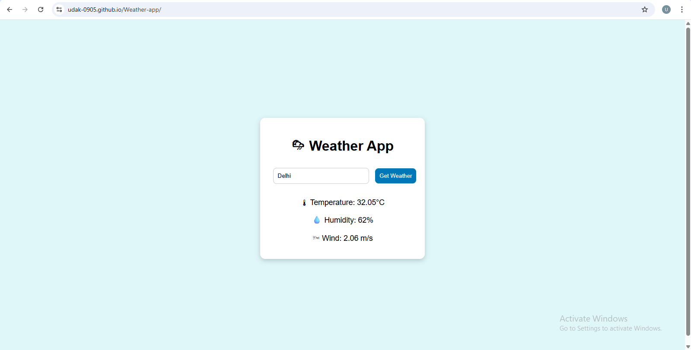

# 🌦 Weather App

A simple weather application that lets users check the current weather of any city using the OpenWeatherMap API.

## 🚀 Features

- 🌤 Real-time weather data
- 📍 Search by city name
- 📊 Shows temperature, humidity, and wind speed

## 🛠 Tech Stack

- HTML, CSS, JavaScript
- OpenWeatherMap API
- GitHub Pages for deployment
- 
## 📸 Preview

## 🔗 Live Site

[Live Site Link](https://UDAK-0905.github.io/Weather-app/)

## 📌 How to Use

1. Type a city name in the input box.
2. Click the search button.
3. View the current weather information.

## 🧠 Learnings

This project helped me understand:
- How to work with APIs in JavaScript
- DOM manipulation and async/await
- Hosting a site with GitHub Pages

---
